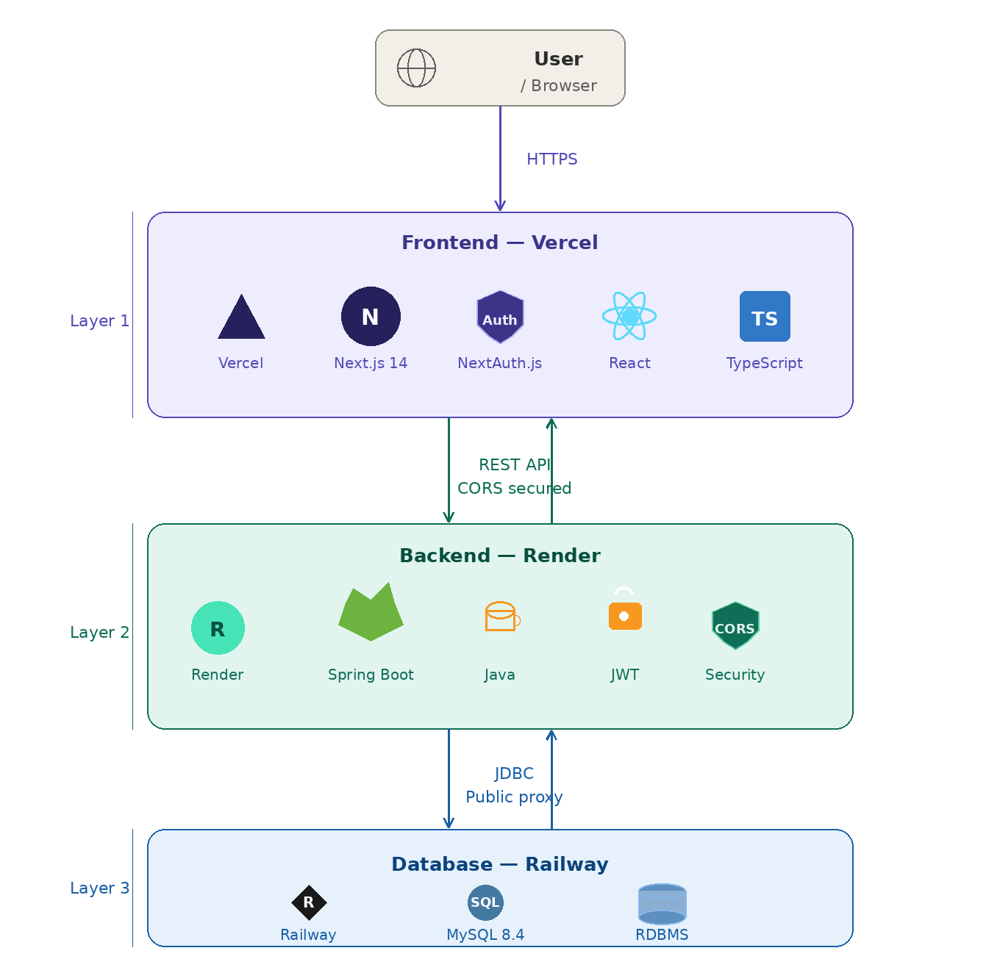

# DigitalPulse - Integrated ECG Analysis & AI Monitoring System

DigitalPulse は、MIT-BIH不整脈データベースを活用した、医療従事者向けの次世代心電図解析プラットフォームです。AIによる自動診断支援、高精度な波形可視化、そして臨床レポート出力機能を備え、医療現場のデジタル化を強力にサポートします。

🔗 [https://digital-pulse-psi.vercel.app/](https://digital-pulse-psi.vercel.app/)

> **テストログイン用アカウント**
> - ID: `admin`
> - PW: `password123`

---

## 🏗️ システム環境構成 (Architecture)

本番環境は、可用性と運用コストのバランスを考慮した、モダンなマルチクラウド構成を採用しています。



---

## 🚀 主要機能 (Key Features)

### インタラクティブ波形解析

- **高精度可視化**: Rechartsを用いたスケーラブルな波形表示。Brush機能による特定区間のズーム解析が可能。
- **波形最適化ロジック**: データセット特有のパディング（末尾の無駄なフラットライン）を自動でトリミングし、心拍の主要部分を強調。

### AI自動診断 & フィルタリング

- **不整脈分類**: MIT-BIHデータセットに基づき、SVEB・VEB・Fusion・Unknownの4種の異常を自動検知。
- **高度な検索機能**: 500件以上の記録から、特定の患者IDや異常フラグによる瞬時の絞り込み。

### プロフェッショナルPDFレポート

- **臨床報告書発行**: 患者情報、解析グラフ、医師の所見を統合したA4サイズのPDFレポートをワンクリックで出力。

### セキュアな認証基盤

- **NextAuth.js連携**: 医療情報（PHR）を保護するための、ログイン・セッション管理機能。
- **アクセス制御**: Middlewareを用いた未認証ユーザーによるデータアクセス制限。

---

## 🧠 技術的な挑戦と解決策 (Technical Challenges)

### 最新CSSとPDFライブラリの互換性エラーの解決

Tailwind CSS v4が採用する最新のカラーフォーマット（`oklch`等）が、PDF出力ライブラリでレンダリングエラーを引き起こす問題に直面しました。

**解決策**: PDF生成の直前にDOMをクローンし、計算済みスタイル（Computed Style）を標準的なRGB形式に強制変換して上書きするロジックを実装することで解決しました。

### フルスタックな認証フローとCORSの克服

Vercel（フロント）とRender（バック）という異なるドメイン間での認証付き通信において、CORSポリシーと認証情報の受け渡しが最大の難所でした。

**解決策**: Spring Boot側の `WebConfig` で `allowedOriginPatterns` を用いVercelのサブドメインを厳密に許可。さらに `allowCredentials(true)` と `credentials: "include"` を組み合わせることで、セキュアなクロスドメイン認証を完結させました。

### データ構造の最適化

MIT-BIHデータセットは固定長のため、グラフが左に寄る視認性の悪さがありました。

**解決策**: 配列を末尾からスキャンし、有効なデータ点までを動的に切り出す（Trimming）処理をフロントエンドに実装。常に波形が中央に表示されるUXを実現しました。

---

## 🛠 技術スタック (Tech Stack)

| カテゴリ | 技術 |
|---|---|
| **Frontend** | Next.js 14/16 (App Router), Tailwind CSS v4, Framer Motion, Recharts, html2pdf.js |
| **Backend** | Java 21, Spring Boot 3.4, Spring Data JPA |
| **Database** | MySQL 8.4 (Hosted on Railway) |
| **DevOps** | Vercel (Frontend), Render (Backend), GitHub Actions |

---

## 📦 セットアップ手順 (Local Setup)

### バックエンド (Spring Boot)

1. `src/main/resources/application.properties` にMySQLの設定を記述。
2. 以下の環境変数を設定:
   ```
   MYSQLHOST=...
   MYSQLPORT=...
   MYSQLUSER=...
   MYSQLPASSWORD=...
   ```
3. 起動:
   ```bash
   ./mvnw spring-boot:run
   ```

### フロントエンド (Next.js)

1. 依存関係をインストール:
   ```bash
   npm install
   ```
2. `.env.local` に以下を設定:
   ```env
   NEXT_PUBLIC_API_URL=http://localhost:10000
   NEXTAUTH_SECRET=（32文字以上の任意文字列）
   NEXTAUTH_URL=http://localhost:3000
   ```
3. 起動:
   ```bash
   npm run dev
   ```

---

## 📧 Contact

開発者へのフィードバックやお問い合わせは、[GitHub Issues](#) まで。

---

*© 2026 DigitalPulse Medical System. Created for Academic Purposes.*
