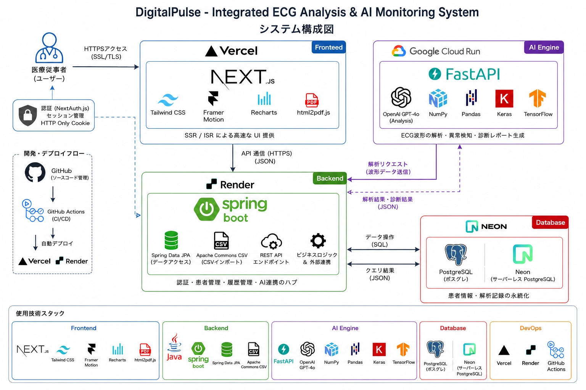

# DigitalPulse - Integrated ECG Analysis & AI Monitoring System

DigitalPulse は、MIT-BIH不整脈データベースを活用した、医療従事者向けの次世代心電図解析・患者管理プラットフォームです。AIによる自動判定、高精度な波形可視化、そして臨床レポート出力機能を、セキュアなマルチクラウド環境で実現しました。

🔗 [https://digital-pulse-psi.vercel.app/](https://digital-pulse-psi.vercel.app/)

> **テストアカウント:** `admin` / `password123`

---

## 📂 ディレクトリ構成 (Project Structure)

```text
.
├── apps/
│   ├── ecg-frontend/                     # Next.js 15 Frontend
│   │   ├── app/
│   │   ├── components/
│   │   ├── public/
│   │   └── package.json
│   │
│   ├── ecg-api/                          # Spring Boot Backend
│   │   ├── src/main/java/
│   │   ├── src/main/resources/
│   │   └── pom.xml
│   │
│   └── ecg-ai/                   # FastAPI AI Service
│       ├── app/
│       ├── models/
│       ├── requirements.txt
│       └── main.py
│
├── docs/
│   ├── DigitalPulse_ER図.pdf
│   ├── DigitalPulse_画面遷移図.pdf
│   ├── DigitalPulse_基本設計書.pdf
│   ├── DigitalPulse_詳細設計書.pdf
│   ├── DigitalPulse_要件定義書.pdf
│   ├── DP-TP-001_テスト計画書.pdf
│   ├── DP-TR-001_テスト結果報告書.pdf
│   └── DP-TS-001_テスト仕様書.pdf
│
├── assets/
│   ├── screenshots/                  # UIスクリーンショット
│   └── sample-ecg/                   # ECGサンプルデータ
│
├── scripts/
│   └── ecg-data-importer/
│
├── README.md
├── LICENSE
├── .gitignore
````

---

## 🏗️ システム環境構成 (Architecture)

本番環境は、高可用性とスケーラビリティを両立したマルチクラウド構成を採用しています。



---

## 🚀 主要機能 (Key Features)

### 1. インテリジェント・アナリティクス・ダッシュボード
- **リアルタイム統計:** 総解析数、異常検知数、未確認レポート数をカード形式で即座に把握。
- **高度な絞り込み:** 患者IDによる動的なフィルタリングと、異常フラグによる緊急データの抽出。

### 2. 包括的患者管理システム (CRM)
- **電子カルテ機能:** 患者の新規登録、基本情報管理。
- **履歴管理:** 患者ごとの時系列的な心電図検査履歴の自動集約。
- **ターゲット・インポート:** 特定の患者に紐付けた状態でのCSVバルクインポート機能。

### 3. インタラクティブ波形解析
- **高精度可視化:** Rechartsを用いたスケーラブルな波形表示。パディングの自動トリミングにより心拍を強調。
- **AI判定連携:** MIT-BIHデータセットに基づき、SVEB・VEB・Fusion・Unknownの異常を自動分類。

### 4. プロフェッショナルPDFレポート
- **臨床報告書発行:** 患者情報、解析グラフ、AI診断、医師の所見を統合したA4レポートをワンクリックで出力。

---

## 🧠 技術的な挑戦と解決策 (Technical Challenges)

### セキュア・レイアウト・パターンの実装
**課題:** ログアウト後もサイドバーが残存し、直リンクで患者情報にアクセスできてしまう脆弱性がありました。

**解決策:** `AppLayout` コンポーネントによる「番人ロジック」を実装。NextAuthのセッション状態とパス名を監視し、未認証ユーザーをトップページへ強制リダイレクトさせると同時に、認証時のみサイドバーを表示する条件付きレンダリングを統合しました。

---

### クロスドメイン認証とCORSの克服
**課題:** VercelとRenderという異なるドメイン間での `HttpOnly Cookie` の共有。

**解決策:** Spring Boot側で `allowedOriginPatterns` を厳密に設定し、`allowCredentials(true)` を有効化。フロントエンド側でも `credentials: "include"` を徹底することで、セキュアなクロスドメイン認証を完結させました。

---

### データベース・スキーマの無停止移行
**課題:** 運用中のデータベースに対し、外部キー制約（FK）が張られたカラムに `AUTO_INCREMENT` を追加する際の `Incompatible` エラー。

**解決策:** `FOREIGN_KEY_CHECKS` の一時無効化および、制約の一時削除・再構築を伴う移行スクリプトを実行し、データの整合性を保ったままスキーマを最適化しました。

---

## 📦 セットアップ手順 (Local Setup)

### バックエンド (Spring Boot)

1. `src/main/resources/application.properties` にMySQLの設定を記述。
2. 以下の環境変数を設定（Railway等から取得）:
   MYSQLHOST
   MYSQLPORT
   MYSQLUSER
   MYSQLPASSWORD
   MYSQLDATABASE

3. 起動:
```bash
   ./mvnw spring-boot:run
```

### フロントエンド (Next.js)

1. 依存関係のインストール:
```bash
   npm install
```
2. `.env.local` の設定:
```env
   NEXT_PUBLIC_API_URL=http://localhost:10000
   NEXTAUTH_SECRET=your_32bit_secret
   NEXTAUTH_URL=http://localhost:3000
```
3. 起動:
```bash
   npm run dev
```

---

## 📧 Contact

開発者へのフィードバックやお問い合わせは、[GitHub Issues](https://github.com) まで。

---

*© 2026 DigitalPulse Medical System. Created for Academic Purposes.*

---

## ⚖️ ライセンス / OSS・データセット表記

### プロジェクトライセンス
本プロジェクトは MIT License のもとで公開されています。  
詳細は `LICENSE` ファイルを参照してください。

### 利用データセット
本システムでは、PhysioNet が提供する MIT-BIH Arrhythmia Database（Kaggleにて配布されている加工済みデータセット）を研究・学習用途で利用しています。

- Dataset: MIT-BIH Arrhythmia Database
- Provider: PhysioNet
- URL: https://physionet.org/content/mitdb/

利用時は PhysioNet の利用条件および引用ポリシーに従ってください。

### 使用OSSライブラリ
本システムでは Next.js / React / Spring Boot / FastAPI / Recharts など、
各ライブラリのライセンス条件に従って OSS を利用しています。
詳細な依存関係ライセンスは各 `package-lock.json` / `pom.xml` / `requirements.txt` を参照してください。
